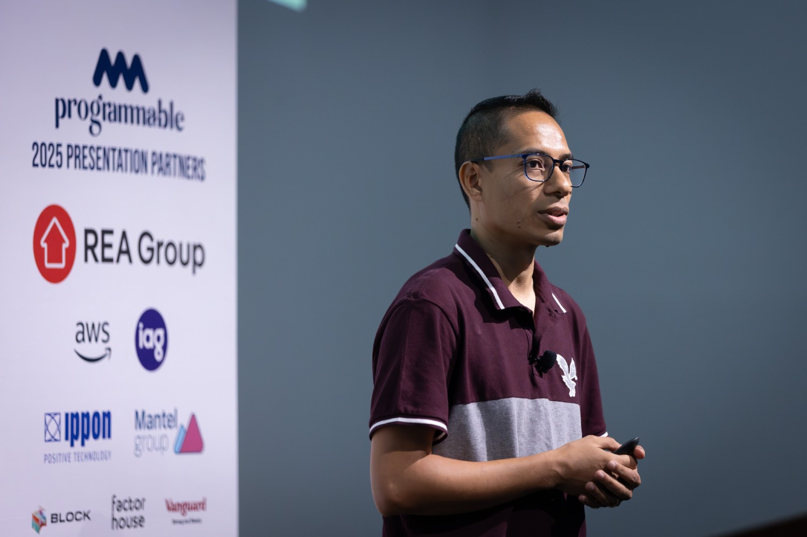
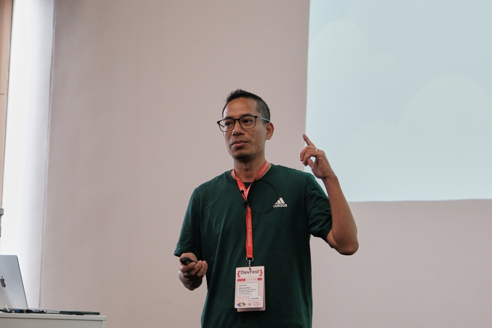
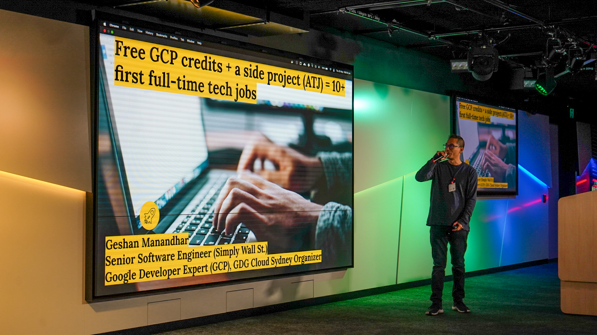

# Geshan Public Speaking

Here is a timeline of most of my public speaking for tech conferences and meetups. All my talks are in English.

I am open to speaking offers, mainly in Sydney, Australia. The best way to reach me is by
[email](mailto:geshan@gmail.com?subject=Interested%20for%20a%20talk%3F), thanks!.

Inspired by other public-speaking repos like [these](https://github.com/ahmetb/public-speaking) [ones](https://github.com/danicat/public-speaking).

## Speaker Bio

Geshan is a seasoned software engineer with over 17 years of software engineering experience. Currently, he serves Simply Wall St. as a senior software engineer in Sydney, Australia. He is a language-agnostic software engineer who believes the value provided to the business is more important than the choice of language or framework. With a keen interest in REST architecture, microservices, agile software engineering, and serverless, he has spoken at tech conferences in the Middle East, Europe, the United States, and Australia. He is actively involved with the developer community and is a Google Developer Expert (GDE) for the Google Cloud Platform (GCP). He is a Docker Captain, too. Blogging since 2007, he has a well-maintained tech blog, where he shares his views and ideas.

## Future

* None planned

## Past

| Date        | Event                                                                                                                             | Talk/Slides 📜                                                                                                                                                                                                                 | Video 📹                                                         | Attendance | Mention                                                                                                                        |
|-------------|-----------------------------------------------------------------------------------------------------------------------------------|-------------------------------------------------------------------------------------------------------------------------------------------------------------------------------------------------------------------------------|-----------------------------------------------------------------|------------|----------------------------------------------------------------------------------------------------------------------------------|
| **2025 ⬇️** | --                                                                                                                                | --                                                                                                                                                                                                                            | --                                                              | --         | --                                                                                                                               |
| 15-Aug-2025 | [GDE Summit APAC Region 2025, Shanghai, China](https://www.linkedin.com/feed/update/urn:li:activity:7362071245305102336/) 🇨🇳  | [Blogging, Gen AI and learnings from it](https://docs.google.com/presentation/d/1pcnbhU3VOzRU0Ft9ekRv-16fZAB2NsDEtliwHsA07s0/edit?usp=sharing)        | -      | ~155        | [here](https://www.linkedin.com/feed/update/urn:li:activity:7362071245305102336/) |
| 18-Jun-2025 | [Build with AI Sydney Jun 2025](https://gdg.community.dev/events/details/google-gdg-cloud-sydney-presents-build-with-ai-notebooklm-and-build-a-timesheet-agent-with-gemini/) 🇦🇺  | [NotebookLM and other Google Labs products](https://docs.google.com/presentation/d/1ux9gRw9ez13r_QMK27pFE2eJPKzLPzli8TUDurURAl4/edit?usp=drive_link)        | [link](https://www.youtube.com/watch?v=CXwG-hwrAWU)      | ~150        | [here](https://www.linkedin.com/feed/update/urn:li:activity:7341242064656900096/) |
| 04-Apr-2025 | [Build with AI Canberra 2025](https://gdg.community.dev/events/details/google-gdg-canberra-presents-build-with-ai-workshop/) 🇦🇺  | [How to use Gemini to figure out the (almost) exact location from any photo (Workshop)](https://docs.google.com/presentation/d/1ETu4612YqE89wcMz622Sbp9nVr6kyoDhxtccZGSTvYo/edit?usp=sharing)        | -      | ~70        | [here](https://www.linkedin.com/posts/geshan_canberra-gdgcanberra-gdgoncampusanu-activity-7314487046092247040-Sk9X?utm_source=share&utm_medium=member_desktop&rcm=ACoAAAHqyxQBNdogbSZXcYxOOON987QCmTCOn9A) |
| 20-Mar-2025 | [Programmable Sydney](https://www.programmable.tech/) 🇦🇺  | [Embrace feature flags, unlock better customer experience and developer confidence](https://docs.google.com/presentation/d/1xpOBI1FoQR0HmQbG-GHodShBQ06z6jV74IVjEpWPINo/edit?usp=sharing)        | -      | ~90        | [here](https://www.linkedin.com/feed/update/urn:li:activity:7308623335796391936/)                            |
| 04-Feb-2025 | [GDG Cloud Sydney meetup Feb 2025](https://gdg.community.dev/events/details/google-gdg-cloud-sydney-presents-gdg-cloud-sydney-meetup-feburary-2025/) 🇦🇺  | [Modernise web scraping: use a self-hosted LLM to extract data from (almost) any website](https://docs.google.com/presentation/d/1fIBfo7qsffjQUdU-OCDcRUuBkotNBKJpD04F4k5EcjE/edit?usp=sharing)        | [link](https://www.youtube.com/watch?v=0BqWNjT0yHQ)      | ~125        | [here](https://www.linkedin.com/feed/update/urn:li:ugcPost:7292651970111123458/)                            |
| 23-Jan-2025 | [DevOps Sydney meetup Jan 2025](https://www.meetup.com/devops-sydney/events/304821878/) 🇦🇺  | [You build it, Google runs it (serverlessly) in containers](https://docs.google.com/presentation/d/15UaZqOV41dnjnarWUmqsvnFQdTjkEpBCDM4RgDMDoNk/edit?usp=sharing)                              | -                                                         | ~25        | [here](https://www.linkedin.com/feed/update/urn:li:ugcPost:7288293356969828354/)                            |
| **2024 ⬇️** | --                                                                                                                                | --                                                                                                                                                                                                                            | --                                                              | --         | --                                                                                                                               |
| 10-Nov-2024 | [GDG Auckland DevFest 2024](https://devfest.gdgauckland.nz/#schedule) 🇳🇿  | [You build it, Google runs it (serverlessly) in containers](https://docs.google.com/presentation/d/15UaZqOV41dnjnarWUmqsvnFQdTjkEpBCDM4RgDMDoNk/edit?usp=sharing)                              | -                                                         | ~80        | [here](https://www.linkedin.com/feed/update/urn:li:activity:7262967034626416642/)                            |
| 25-Oct-2024 | [GDG Hobart DevFest 2024](https://gdg.community.dev/events/details/google-gdg-hobart-presents-gdg-hobart-devfest-2024/) 🇦🇺  | [How to build an E-commerce product description generator using Gemini](https://docs.google.com/presentation/d/1WboHu9zHIQLoiW_RO20KXLQb6twLdGLBNy_e3iadk94/edit?usp=sharing)                              | -                                                         | ~40        | [here](https://www.linkedin.com/posts/geshan_devfest-hobart-devfest-activity-7256078759454224385-UzzO/)                            |
| 12-Jul-2024 | [Google I/O Extended Adelaide 2024](https://gdg.community.dev/events/details/google-gdg-adelaide-presents-google-io-extended-adelaide/) 🇦🇺  | [You build it, Google runs it (serverlessly) in containers](https://docs.google.com/presentation/d/15UaZqOV41dnjnarWUmqsvnFQdTjkEpBCDM4RgDMDoNk/edit?usp=sharing)                              | -                                                         | ~55        | [here](https://www.linkedin.com/posts/geshan_flutter-google-googleioextended-activity-7218051855166132224-9g7L)                            |
| 30-May-2024 | [Cloudheads Meetup May 2024 - Serverless crafters](https://events.humanitix.com/serverless-crafters) 🇦🇺                                            | [You build it, Google runs it (serverlessly) in containers](https://docs.google.com/presentation/d/15UaZqOV41dnjnarWUmqsvnFQdTjkEpBCDM4RgDMDoNk/edit?usp=sharing)                              | [link](https://youtu.be/L5DN8ztZ3Ko)                                                         | ~35        | [here](https://www.linkedin.com/posts/geshan_it-felt-great-to-speak-at-cloudheads-may-activity-7202097197499232256--5I4/)                            |
| 13-May-2024 | [GDG Cloud Sydney Meetup May 2024](https://gdg.community.dev/events/details/google-gdg-cloud-sydney-presents-gdg-cloud-sydney-meetup-may-2024/) 🇦🇺                                            | [You build it, Google runs it (serverlessly) in containers](https://docs.google.com/presentation/d/15UaZqOV41dnjnarWUmqsvnFQdTjkEpBCDM4RgDMDoNk/edit?usp=sharing)                              | [link](https://www.youtube.com/watch?v=GYCd0CMQfPw)                                                         | ~70        | [here](https://www.linkedin.com/posts/gdg-sydney_gdg-gdgsydney-gdgcloudsydney-activity-7195935046422155264-VUl9)                            |
| 29-Apr-2024 | [Build with AI Workshop Sydney 2024](https://gdg.community.dev/events/details/google-gdg-sydney-presents-build-with-ai-workshop/cohost-gdg-cloud-sydney) 🇦🇺                                            | [How to build an E-commerce product description generator using Gemini](https://docs.google.com/presentation/d/1WboHu9zHIQLoiW_RO20KXLQb6twLdGLBNy_e3iadk94/edit?usp=sharing)                              | [link](https://www.youtube.com/watch?v=Qz83Y0uBkNc)                                                         | ~180        | [here](https://www.linkedin.com/feed/update/urn:li:activity:7190952128968859649/)                            |
| 18-Feb-2024 | GDG ANZ Summit 2024 🇦🇺                                            | [How to nurture sustainable tech communities: experiences since 2006](https://docs.google.com/presentation/d/1rOCQ1-VW7gg6KCq5RbIcT4uFsxWaewj8zy8ICY5FIzM/edit?usp=sharing)                              | -                                                         | ~40        | [here](https://www.linkedin.com/posts/geshan_ai-nepali-gdg-activity-7165090475572482049-R1Gu/)                            |
| **2023 ⬇️** | --                                                                                                                                | --                                                                                                                                                                                                                            | --                                                              | --         | --                                                                                                                               |
| 9-Dec-2023 | [GDG Devfest Brisbane 2023](https://devfest-brisbane-2023.sessionize.com/) 🇦🇺                                            | [From 0 to working serverless url for a containerized app](https://docs.google.com/presentation/d/1Ir0cAS4084Smy64BQ0kXaPDx1UsiUfmkmUZ0Ax2xW60/edit?usp=sharing)                              | [link](https://www.youtube.com/watch?v=O--IoYiHU98)                                                         | ~75        | [here](https://www.linkedin.com/posts/gdg-brisbane_devfestbrisbane-googlecloudrun-techtalk-activity-7139048179466981377-cvvF)                            |
| 7-Oct-2023 | [GDG Devfest Melbourne 2023](https://gdg-melbourne-devfest-2023.sessionize.com/) 🇦🇺                                            | [From 0 to working serverless url for a containerized app](https://docs.google.com/presentation/d/1Ir0cAS4084Smy64BQ0kXaPDx1UsiUfmkmUZ0Ax2xW60/edit?usp=sharing)                              | [link](https://www.youtube.com/watch?v=aukhOeWBNI0)                                                         | ~125        | [here](https://www.linkedin.com/feed/update/urn:li:activity:7116555063682072577/)                            |
| 16-Sep-2023 | Google Developers Students Club (GDSC) Summit Sydney 2023 🇦🇺                                            | [The art of impactful presentations: Tips for engaging your audience](https://docs.google.com/presentation/d/1t3M71hSW-l4Cv66ggF4zcp-62_NPKPgCaGglNcz4j20/edit?usp=sharing)                              | -                                                              | ~35        | [here](https://www.linkedin.com/feed/update/urn:li:activity:7109292316007284736/)                            |
| 24-Jun-2023 | [Ace Your Career: Tips & Tricks from the Pros](https://www.eventbrite.com.au/e/gdsc-usyd-x-unsw-x-gdg-sydney-ace-your-career-tips-tricks-from-the-pros-tickets-650487695207) 🇦🇺                                            | [How to craft your resume the right way](https://docs.google.com/presentation/d/1udFY8UTdH5awjVzHHCapuQ6LoisZa4_vy23GBFsu1RQ/edit?usp=sharing)                              | [link](https://www.youtube.com/watch?v=moP8Qjv9gaU)                                                              | ~65        | [here](https://www.linkedin.com/feed/update/urn:li:activity:7078607546718064641/)                            |
| 26-May-2023 | [GDG Darwin Meetup - May 2023](https://www.meetup.com/gdg-darwin/events/293343872/) 🇦🇺                                            | [From 0 to working serverless url for a containerized app with Google Cloud Run](https://docs.google.com/presentation/d/1Ir0cAS4084Smy64BQ0kXaPDx1UsiUfmkmUZ0Ax2xW60/edit?usp=sharing) - Online                               | -                                                               | ~60        | [here](https://www.linkedin.com/posts/geshan_google-developer-event-ugcPost-7068783432713056256-nzkl)                            |
| 25-May-2023 | [GDG Cloud Sydney Meetup May 2023](https://www.meetup.com/gdgcloudsydney/events/292947927/) 🇦🇺                                    | [Free GCP credits + a side project (ATJ) = 10+ first full-time tech jobs](https://docs.google.com/presentation/d/1PU5qHaS1OU8gCzqoc3OZRWy0nqqYaZVeu_3UcViEylM/edit?usp=sharing)                                               | [link](https://www.youtube.com/watch?v=8eGbNp7qb_Q)             | ~110       | [here](https://www.linkedin.com/posts/geshan_sydney-meetup-gde-activity-7067739792779710464-_v-t)                                |
| **2022 ⬇️** | --                                                                                                                                | --                                                                                                                                                                                                                            | --                                                              | --         | --                                                                                                                               |
| 16-Nov-2022 | [GDG Cloud Sydney Meetup - Nov 2022](https://www.meetup.com/gdgcloudsydney/events/289223728/) 🇦🇺                                  | [From 0 to working serverless url for a containerized app with Google Cloud Run](https://bit.ly/sc-talk-22)                                                                                                                   | -                                                               | ~70        | -                                                                                                                                |
| **2019 ⬇️** | --                                                                                                                                | --                                                                                                                                                                                                                            | --                                                              | --         | --                                                                                                                               |
| 26-Nov-2019 | [GDG Cloud Sydney Meetup - Nov 2019](https://www.meetup.com/gdgcloudsydney/events/266272518/) 🇦🇺                                  | [From 0 to working serverless url for a containerized app with Google Cloud Run](https://www.slideshare.net/geshan/from-0-to-working-serverless-url-for-a-containerized-app-with-google-cloud-run-2)                          | -                                                               | ~65        | [here](https://twitter.com/geshan/status/1199255162470195200)                                                                    |
| 16-Nov-2019 | [GDG Devfest Sydney 2019](https://devfest.org.au/) 🇦🇺                                                                             | [From 0 to working serverless url for a containerized app with Google Cloud Run](https://www.slideshare.net/geshan/from-0-to-working-serverless-url-for-a-containerized-app-with-google-cloud-run-2)                          | -                                                               | ~80        | [here](https://twitter.com/akritibhusal/status/1195497413416382464)                                                              |
| 31-Oct-2019 | [Laracon AU Sydney 2019](https://laracon.com.au/) 🇦🇺                                                                              | [Are logs a software engineer’s best friend? Yes -- follow these best practices](https://www.slideshare.net/geshan/are-logs-a-software-engineers-best-friend-yes-follow-these-best-practices)                                 | [link](https://www.youtube.com/watch?v=6I1MK3lNZPI)             | ~210       | [here](https://geshan.com.np/blog/2019/11/laracon-au-2019-overall-a-good-experience/)                                            |
| 27-Aug-2019 | [Serverless Days Sydney 2019](https://sydney.serverlessdays.io/) 🇦🇺                                                               | [From 0 to working serverless url for a containerized app with Google Cloud Run](https://www.slideshare.net/geshan/from-0-to-working-serverless-url-for-a-containerized-app-with-google-cloud-run-2)                          | [link](https://www.youtube.com/watch?v=bw3-IPw40Ic)             | ~250       | [here](https://twitter.com/ben11kehoe/status/1166170348162699265)                                                                |
| 25-Jul-2019 | [Container Camp AU 2010](https://2019.container.camp/au/) 🇦🇺                                                                      | [Moving from A and B to 150 microservices, the journey, and learnings](https://www.slideshare.net/geshan/moving-from-a-and-b-to-150-microservices-the-journey-and-learnings)                                                  | [link](https://www.youtube.com/watch?v=obArtQ_WYKM)             | ~200       | [here](https://twitter.com/containercamp/status/1154185063526854656)                                                             |
| 11-Jul-2019 | [Serverless Sydney Meetup July Edition](https://www.meetup.com/en-AU/Sydney-Serverless-Meetup-Group/events/261994106/) 🇦🇺         | [From 0 to working serverless url for a containerized app with Google Cloud Run](https://www.slideshare.net/geshan/from-0-to-working-serverless-url-for-a-containerized-app-with-google-cloud-run-2)                          | [link](https://youtu.be/JypAvBGVAko)                            | ~80        | [here](https://www.meetup.com/Sydney-Serverless-Meetup-Group/photos/30157473/483023433/#483023415)                               |
| 16-May-2019 | [DevOps Sydney Meetup](https://www.meetup.com/en-AU/devops-sydney/events/dkwcwqyzhbvb/) 🇦🇺                                        | [Moving from A and B to 150 microservices, the journey, and learnings](https://www.slideshare.net/geshan/moving-from-a-and-b-to-150-microservices-the-journey-and-learnings)                                                  | -                                                               | ~150       | [here](https://www.meetup.com/devops-sydney/photos/29903777/481365537/#481365537)                                                |
| 7-Feb-2019  | [Node Sydney Meetup Feb 2019](https://www.meetup.com/en-AU/node-sydney/events/cvdqzpyzdbkb/) 🇦🇺                                   | [We lost $ 20.5K in one day and how we could have saved it… hint: better automated testing](https://www.slideshare.net/geshan/we-lost-205k-in-one-day-and-how-we-could-have-saved-it-hint-better-automated-testing-130685136) | -                                                               | ~125       | [here](https://twitter.com/incessantmeraki/status/1093417622073266176)                                                           |
| **2018 ⬇️** | --                                                                                                                                | --                                                                                                                                                                                                                            | --                                                              | --         | --                                                                                                                               |
| 24-Oct-2018 | [DevOps Days Newcastle 2018](https://devopsdaysnewy.org/) 🇦🇺                                                                      | [Moving from A and B to 150 microservices, the journey, and learnings](https://www.slideshare.net/geshan/moving-from-a-and-b-to-150-microservices-the-journey-and-learnings)                                                  | [link](https://www.youtube.com/watch?v=QitdhwHYAVE)             | ~350       | [here](https://geshan.com.np/blog/2018/10/moving-from-a-and-b-to-~150-microservices/)                                            |
| 06-Sep-2018 | [Node Sydney Meetup Sep 2018](https://www.meetup.com/node-sydney/events/cvdqzpyxmbjb/) 🇦🇺                                         | [Moving from A and B to 150 microservices, the journey, and learnings](https://www.slideshare.net/geshan/moving-from-a-and-b-to-150-microservices-the-journey-and-learnings)                                                  | -                                                               | ~125       | [here](https://www.meetup.com/node-sydney/photos/29230881/474364679/)                                                            |
| **2017 ⬇️** | --                                                                                                                                | --                                                                                                                                                                                                                            | --                                                              | --         | --                                                                                                                               |
| 01-Aug-2017 | [DevOps Days Portland 2017](https://devopsdays.org/events/2017-portland/welcome/) 🇺🇸                                              | [Adopt a painless continuous delivery culture, add more business value](https://www.slideshare.net/geshan/adopt-a-painless-continuous-delivery-culture-add-more-business-value)                                               | [link](https://www.youtube.com/watch?v=2oYPAHJwr6U)             | ~225       | [here](https://geshan.com.np/blog/2017/08/adopt-a-painless-continuous-delivery-culture/)                                         |
| 4-Feb-2017  | [Developers Nepal Meetup #3](https://docs.google.com/document/d/1O5UcHK6p5yk75o6z56SBLNAlmgaNa8OfVQ0icf-JS9A/edit?usp=sharing) 🇳🇵 | [Things I wished I knew as a junior developer](http://www.slideshare.net/geshan/things-i-wished-i-knew-as-a-junior-developer)                                                                                                 | [link](https://www.youtube.com/watch?v=cLokEa545SY)             | ~150       | [here](https://geshan.com.np/blog/2017/02/things-i-wished-i-knew-as-a-junior-developer-slides/)                                  |
| **2016 ⬇️** | --                                                                                                                                | --                                                                                                                                                                                                                            | --                                                              | --         | --                                                                                                                               |
| 23-Aug-2016 | [Laracon EU 2016](https://laracon.eu/2016/) 🇳🇱                                                                                    | [Embrace chatops, stop installing deployment software](https://www.slideshare.net/geshan/embrace-chatops-stop-installing-deployment-software-larcon-eu-2016)                                                                  | [link](https://www.youtube.com/watch?v=SZ3UfwBACIo)             | ~525       | [here](https://geshan.com.np/blog/2016/08/number-laraconeu-2016-was-a-great-experience-overall/)                                 |
| 25-Jun-2016 | [PHP Developers Nepal Meetup #16](https://www.facebook.com/events/144558125955439/) 🇳🇵                                            | [Do you Git your code? Follow simplified gitflow branching model to improve productivity](https://www.slideshare.net/geshan/do-you-git-your-code-follow-simplified-gitflow-branching-model-to-improve-productivity)           | [link](https://www.youtube.com/watch?v=jznORrhoV-M)             | ~100       | [here](https://geshan.com.np/blog/2016/06/php-developers-nepal-meetup-number-16-a-round-up-and-my-simpilfied-gitflow-talk/)      |
| 01-Apr-2016 | [CodeMotion Dubai 2016](https://dubai2016.codemotionworld.com/) 🇦🇪                                                                | [Embrace chatops, stop installing deployment software](https://www.slideshare.net/geshan/embrace-chatops-stop-installing-deployment-software-draft-1)                                                                         | [link](https://www.youtube.com/watch?v=GVa1I2QiZs4)             | ~40        | [here](https://geshan.com.np/blog/2016/04/embrace-chatops-stop-installing-deployment-software/)                                  |

* I have not included some talks I gave internally for places I work or worked for or when I spoke at colleges in Kathmandu, Nepal.
* A longer (but less organized) list is available on by [blog](https://geshan.com.np/blog/categories/talks/) with talks from as early as [2010](https://geshan.com.np/blog/2010/08/drupal-non-technical-introduction-at/).
* You can go to this [Youtube playlist](https://www.youtube.com/watch?v=6I1MK3lNZPI&list=PLhTqkNYfkucwyaMujDSSPkqQj5uTO9alh&index=1) which has most of my talks.

## Some Pictures

### Programmable Sydney 2025

### GDG Auckland DevFest 2024

### GDG Cloud Sydney May 2023 Meetup

### Laracon AU 2019

### DevOps Days New Castle 2018

### DevOps Days Portland 2017

### Laracon EU Amsterdam 2016

## Social

* Blog: [https://geshan.com.np](https://geshan.com.np)
* Twitter: [https://twitter.com/geshan](https://twitter.com/geshan)
* Github: [https://github.com/geshan](https://github.com/geshan)
* LinkedIn: [https://www.linkedin.com/in/geshan/](https://www.linkedin.com/in/geshan/)
